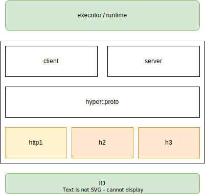

# hyper Vision

## Purpose

This is an overview of what the shape of hyper looks like, but also somewhat
zoomed out, so that the _vision_ can survive while the exact minute details
might shift and change over time.

### Charter

> hyper is a protective and efficient HTTP library for all.

### Tenets

Tenets are guiding principles. They guide how decisions are made for the whole
project. Ideally, we do all of them all the time. In some cases, though, we may
be forced to decide between slightly penalizing one goal or another. In that
case, we tend to support those goals that come earlier in the list over those
that come later (but every case is different).

0. Open
1. Correct
2. Fast
3. HTTP/\*
4. Flexible
5. Understandable

There's a lot more detail about each in [TENETS](./TENETS.md).

## Use Cases

Who are the *users* of hyper? How would they use hyper?

### Low-Level Client Library (curl, reqwest, aws-sdk)

These client libraries care that hyper is **Flexible**, since they are
expressing their own opinion on how a more-featured HTTP client should act.
This includes opinions on connection establishment, management, pooling, HTTP
version options, and even runtimes.

curl's main reason for using hyper is that it is **Safe**.

### Web Server Frameworks (deno, axum)

These are using hyper's server feature to expose a different, higher-level API
to users. Besides the obvious requirements, these require that hyper is
**Fast**. Servers are costly, handling more requests faster is important to
them.

That hyper is **Flexible** is also important, in that it needs to be flexible
enough for them to build a server framework, and allow them to express their
own opinions about API to their users.

### Services and Proxies (linkerd, cloudflare, fastly)

These are using hyper directly, likely both the client and server, in order to
build efficient and powerful services, applications, and tools for their end
users. They care greatly that hyper is **Correct**, since web traffic can
stretch the limits of what is valid HTTP, and exercise less-common parts of the
specifications.

They also require hyper to be **Fast**, for similar reasons that the web server
frameworks do.

### New Rust Web Developers

These are developers who are either new to Rust, or new to web servers, and
have reached for hyper to start with.

It's likely that these users don't have strong opinions about how an HTTP
server or client should work, just that it _should_ handle all the things they
normally assume it would. For these users, it would be best to quickly help
them compare their own expectations with hyper's capabilities, and may
suggest reaching for higher-level, _easier_ libraries instead.

Those that stick around after that recommendation are users that wish both to
learn at a lower level, and to pick and choose what batteries they plug in to
hyper as they move along. While they do care about the other tenets, that hyper
is **Understandable** is of extra importance to them.

## The Library

So with all that context in mind, what does hyper, the library, actually look
like? This doesn't highlight what _is_ and _isn't_ present. What currently
needs to change to reach this vision is left to individual version roadmaps.

### Layers

In all cases, a user brings their own runtime and IO to work with hyper. The IO
is provided to hyper, and hyper acts on top of it. hyper returns `Future`s that
the user then decides how to poll, likely involving their runtime options.

#### Protocol Codecs

hyper has dedicated codecs for the major HTTP versions. Each is internally
designed to be **Correct** and **Fast** when it comes to encoding and decoding.

The individual codecs may be implemented as sub-crates, with a less-stable
promise, to support the **Flexible** needs of some users who wish to build
their own connection management, or customize encoding and decoding beyond what
is officially supported.

#### Connection State Management

A **Correct** implementation includes more than just enforcing certain
characters when encoding and decoding. Order of frames, and flags in certain
frames can affect the state of the connection. Some examples of things enforced
at this layer:

- If a message has a `content-length`, enforce only that many bytes are read or
  written.
- Reading a `Response` before a `Request` is even written implies a mismatched
  reply that should be interpreted as an error.
- The presence of some headers, such as `Connection: close`, or the absence of
  others, such as `content-length` and `transfer-encoding`, can mean that the
  connection should terminate after the current message.
- HTTP/2 and HTTP/3 may send connection-level frames that don't pertain to any
  specific transaction, and must be read and handled regardless of if a user is
  currently checking for a message.

#### HTTP Role and Version Abstraction

This is the public API layer. Methods exposed are around sending and receiving
`http::Request`s and `http::Response`s, not around framing specifics of the
different versions. These are built around a client or server `Connection`
interface.

By exposing this layer publicly, we take care of the **Correct** tenet, by not
forcing the user to send the specific frames themselves. The API should be
designed in a way that a user cannot easily (if at all) create an _incorrect_
HTTP connection.

Motivated by the **Flexible** tenet, there _are_ version-specific options that
can be configured at this level, and version-specific functionality can usually
be handled via `http::Extensions`.

### Not quite stable, but utile (useful)

Beyond what is directly in the hyper crate, there are useful (utile) parts that
may not meet hyper's stability promise. Developing, experimenting, and exposing
those parts is the purpose of the `hyper-util` crate. That crate does not have
the same stability level as hyper. However, the goal is that things that other
libraries might want to expose as a public dependency do not live in
`hyper-util` forever, but rather stabilize and get promoted into `hyper`.

Exactly what gets put into `hyper-util` presently is kept in the roadmap
documents.

### Stability Promise

What even is hyper's stability promise? Does it mean we are "done"? No. Will we
ever make breaking changes again? Probably. We'll still follow the [semantic
versioning](https://semver.org).

Prior to 1.0, hyper has already only done breaking changes once a year. So 1
year isn't much of a promise. We'll have significant more use and understanding
after a few years, and that could prompt some redesign.

As of this writing, we'll promise that _major_ versions of hyper are stable for
3 years. New features will come out in _minor_ versions frequently. If it is
determined necessary to make breaking changes to the API, we'll save them for
after the 3 years.

hyper also establishes a Minimum Supported Rust Version (MSRV). hyper will
support Rust versions at least 6 months old. If a new Rust version is released
with a feature hyper wishes to use, we won't do so until at least 6 months
afterwards. hyper will only ever require a new Rust version as a _minor_
release (1.x), not as a patch (1.x.y).

## Security

The security of hyper is a large part of what makes hyper _protective_. We make
hyper secure via the combined efforts of being **Correct**, focusing on
**HTTP/\***, and making it all **Understandable**.

### Memory Safety

Being **Correct** requires that hyper be memory-safe. Using the Rust language
gets us most of the way there. But there is the ability to write `unsafe`
Rust. Does being **Correct** mean that we can _never_ write `unsafe` code
anywhere? Even if it helps make hyper **Fast**? We can, carefully.

How do we balance the two, so that hyper is secure?

hyper prefers not to have large modules of intertwined `unsafe` code. hyper
does allow small `unsafe` blocks, no more than a few lines, where it's easier
to verify that the `unsafe` code was written **Correctly**.

### Meticulous Testing

hyper's test suite grows and grows. There's a lot that needs to be right.
Parsers, encoders, state machines. When easily isolated, those pieces have
internal unit tests. But hyper also keeps a large list of growing integration
tests that make sure all the parts are **Correct**.

Making writing new tests easy is a high priority. Investing in the testing
infrastructure is a proven way to make sure hyper stays **Correct** and secure.

### Constant Fuzzing

One thing is to know specific cases to test for. But we can't know all the
inputs or states that *might* cause a bug. That's why hyper has rounds of
fuzzing built into its CI. It's also why hyper signs up for and uses resources
to provide *constant*, around-the-clock fuzzing, always looking for something
that hyper should be hardened against.

### Security Process

hyper has an outlined
[SECURITY](https://github.com/hyperium/hyper/blob/master/SECURITY.md) process,
so we can safely report and fix issues.

## Non-goals

After writing this up, it is easier to articulate what sorts of things many
might associate with an HTTP library, but which are explicitly *not* for hyper.
These are all things that definitely **out of scope**.

- TLS: We learned early that bundling TLS directly in hyper [has
  problems](https://github.com/hyperium/hyper/issues/985). People also have
  very strong opinions about which TLS implementation to use. The design of
  hyper allows users to bring their own TLS.
- Routing
- Cookies
- Not-HTTP: WebSockets, or other protocols that are built next to HTTP. It
  should be possible to _use_ hyper to upgrade, but the actual next-protocol
  should be handled by a different library.
